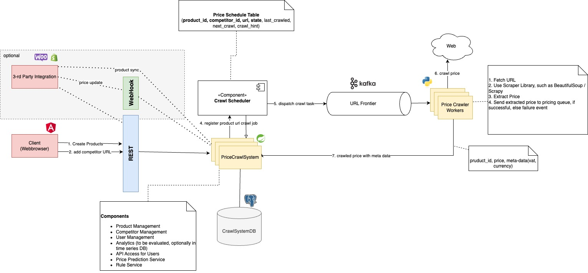
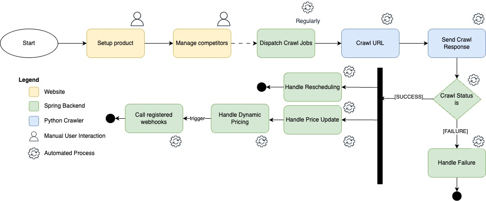

# 🧠 CogniPrice – Competitor Price Tracking System

> **Track, Analyse and Adjust**

## 📜 Project Description

In today’s fast-paced e-commerce world, staying competitive means offering the right price at the right time. As a business owner or e-commerce manager, you know how crucial price competitiveness is. Whether you’re undercutting competitors, matching their prices, or positioning your products at a premium, managing prices manually is time-consuming and inefficient—especially when you have hundreds or thousands of products to monitor.

This is where **CogniPrice** comes in. CogniPrice is an intelligent price crawler system designed to automate price tracking and dynamic pricing. You can manually add products to the system, link competitor URLs, and let the system handle the rest. It periodically crawls these pages to extract current prices and delivers actionable insights through business intelligence features like price charts.

With CogniPrice, you don’t just track prices; you stay ahead of the market.

## 👉 Key Features

- **Automated Price Tracking:** Automatically track competitors' prices in real-time to ensure you’re always up to date.
- **Dynamic Pricing:** Configure pricing rules that automatically adjust your product prices based on real-time market conditions. Available strategies include undercutting competitors, matching prices, or maintaining a premium margin.
- **Price Insights:** Get detailed price charts for competitors to analyze trends and make informed decisions.
- **Easy Product Batch Import:** Save time by importing products in bulk.
- **API Access:** Seamlessly integrate CogniPrice with your existing systems to enhance functionality.
- **WebHooks:** React to price updates in real time and apply pricing strategies instantly.

---

## 🙋 My Role and Contributions  

As the **Project Coordinator**, I proposed the idea for **CogniPrice**, a project developed as part of a university course at TU Vienna. The concept stemmed from my experience as an e-commerce manager, where I recognized the challenges of manual price tracking and the need for automated solutions. I introduced the initial idea and use cases, which we as a team collaboratively refined and developed further.

- **Project Coordination**  
  -	Respnosible for managing project management artifacts, such as the Iceberg List and Project Contract.
  - Managed project timelines, task assignments, and team deliverables.  
  - Maintained structured documentation on GitLab Wiki, ensuring clarity and accessibility.  

- **High-Level Design and Architecture**  
  - Designed the **high level architecture** the **crawl workflow**. Utilized an URL frontier, inspired by concepts from "Introduction to Information Retrieval" by Christopher Manning.  
  - Configured and managed Kafka messaging for efficient communication across components.  

- **Core Technical Contributions**  
  - **URL Scheduler:** Developed the scheduler responsible for dispatching and managing crawl jobs. This service ensures regular crawling, respects rate-limiting rules (politeness), and handles responses effectively ([more informations here](docs/scheduler.md)).  
  - **Dynamic Pricing Engine:** Designed and implemented a service that applies custom pricing strategies based on competitor data, such as "be the cheapest by 2%" or "match the average price." ([more informations here](docs/dynamic_pricing.md))

---

## 🔧 How It Works  

### 🏗️  System Architecture  

  

The system is built around event-driven architecture using **Kafka** as the backbone for communication between services. The **URL Scheduler** and **Dynamic Pricing Engine** are core components, enabling automated price tracking and responsive adjustments.  

---

### 🔄 Workflow Overview  

  

The workflow begins with users setting up products and linking competitor URLs. The **URL Scheduler** periodically dispatches crawl jobs to the crawler. The crawler retrieves the price and currency data from the specified websites and sends back a response indicating success or failure.

Upon receiving the response, the scheduler evaluates the crawl status:
- If successful, the process updates the database with the latest price.
- If a failure occurs, the scheduler reschedules the crawl job (e.g., for the next day).

In parallel, if pricing rules are configured for a product, the system evaluates these rules and adjusts the price dynamically as needed. If any webhooks are registered, the system triggers a price adjustment event to notify external services about the updated pricing.

This automated process ensures timely and accurate pricing updates, enabling real-time dynamic pricing while maintaining a robust fallback mechanism for handling failures.

### Tech Stack

- Java Spring Boot
- Python
- Angular
- Kafka
- Docker
- Kubernets

## 🧑‍🤝‍🧑 Contributers

The following individuals have contributed to the project:

- [Alexander](https://github.com/AlexJS6)
- [Erjan](https://github.com/erjan2001)
- [Florian](https://github.com/OrangeJupiter09)
- [Lorenz](https://github.com/lorenzhoerb)
- Anonymouse (preferred to remain anonymous)
