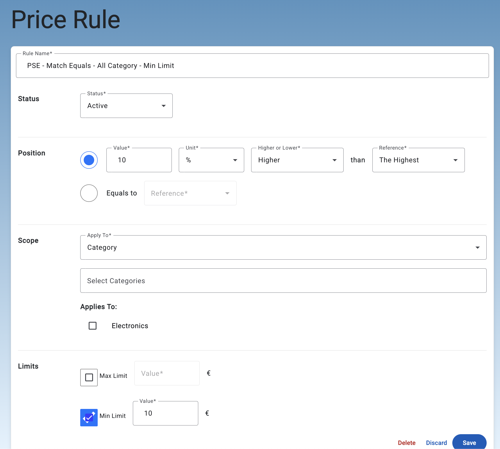

# Service Documentation: Dynamic Pricing

## Overview

The **Dynamic Pricing Service** allows users to configure pricing rules that automatically adjust based on real-time market price changes. With this service, users can define various pricing strategies to maintain competitive pricing for their products. Available strategies include:

- Matching the highest, lowest, or average price among competitors.
- Applying percentage-based or fixed currency increases or decreases to the price.

### Core Object: Pricing Rule

The **Pricing Rule** is the key object in this service, representing a user-defined strategy for adjusting prices dynamically. Examples include:

- **Match the highest price** for a specific product, such as a "Brown T-shirt."
- **Match the lowest price** for all products within the "Fashion" category.
- **Increase the price by 100€** above the highest price for products in the "Fashion" category.

---

## Pricing Rule Configuration

A **Pricing Rule** consists of the following components:

- **Name** (required): A descriptive identifier for the rule.
- **Status** (required): Indicates whether the rule is active or inactive.
- **Position** (required): Defines how the price will be adjusted relative to the reference price (e.g., higher, lower, or equal).
- **Scope** (required): Determines if the rule applies to individual products or entire product categories.
- **Limits** (optional): Specifies minimum and maximum price boundaries for adjustments.

### Position

The **Position** defines how the price should be adjusted in relation to the reference price. It consists of the following elements:

1. **Value**: The numeric value that determines the adjustment. This can be a fixed amount (e.g., 5 EUR) or a percentage (e.g., 10%).
2. **Unit**: Specifies whether the adjustment is a **percentage** or a fixed amount in **EUR**.  
   Possible values:
   - `EUR`: Fixed amount adjustment.
   - `PERCENTAGE`: Percentage-based adjustment.

3. **MatchType**: Defines how the price should be adjusted based on the reference price.  
   Possible values:
   - `EQUALS`: The adjusted price should be equal to the reference price.
   - `HIGHER`: The price should be higher than the reference price.
   - `LOWER`: The price should be lower than the reference price.

4. **Reference**: Determines how the reference price is calculated.  
   Possible values:
   - `CHEAPEST`: The lowest price among competitors.
   - `AVERAGE`: The average price among competitors.
   - `HIGHEST`: The highest price among competitors.

### Scope

The **Scope** defines the scope of products to which the pricing rule applies. It has two possible values:

1. **PRODUCT**: The rule applies to individual products. When the scope is set to `PRODUCT`, the rule targets specific products in the system. You can assign particular products to this rule.

2. **CATEGORY**: The rule applies to product categories. When the scope is set to `CATEGORY`, the rule targets entire product categories, meaning that the rule affects all products within the selected categories.

Example:

- If you create a rule with a **CATEGORY** scope and select the "Fashion" category, the rule will apply to all products in the "Fashion" category.
- If you create a rule with a **PRODUCT** scope and select specific items like "Brown T-shirt" and "Blue Jeans", the rule will only apply to these products.

---

## Price Rule Evaluation

The evaluation of a pricing rule occurs automatically when a new product price is crawled. The rule is evaluated based on the following conditions:

1. The rule must be **active**.
2. The scope of the rule must match the product being evaluated (either an individual product or a product category).

When these conditions are met, the system evaluates the pricing rule, adjusting the product's price based on the defined logic and sending a `PriceAdjustmentDto` event to the Kafka topic `pricing.rule.adjustment`. This event includes information such as the adjusted price, market averages, and other relevant data. Below are the key steps involved in the evaluation:

### 1. Reference Price Calculation

The reference price is calculated using the competitors' market prices and can be one of the following:

- **AVERAGE**: The average price among competitors.
- **HIGHEST**: The highest price among competitors.
- **CHEAPEST**: The lowest price among competitors.

### 2. Position Adjustment

The **Position** in the pricing rule specifies how the reference price should be adjusted:

- **EQUALS**: Set the product price equal to the reference price.
- **HIGHER**: Increase the reference price by either:
  - A percentage: `referencePrice * (1 + value)`
  - A fixed amount in EUR: `referencePrice + value`
- **LOWER**: Decrease the reference price by either:
  - A percentage: `referencePrice * (1 - value)`
  - A fixed amount in EUR: `referencePrice - value`

### 3. Limit Cropping

If limits are defined, the final price is adjusted to stay within the specified boundaries:

- **Min Limit**: Ensures the price does not drop below this value.
- **Max Limit**: Ensures the price does not exceed this value.

### Examples

#### Example 1: Price Calculation

Assume the following market prices for a product:

- Competitor A: 100€
- Competitor B: 120€
- Competitor C: 110€

**Reference Price Calculation:**
- AVERAGE: `(100 + 120 + 110) / 3 = 110€`
- HIGHEST: `120€`
- CHEAPEST: `100€`

**Pricing Rule:**
- **Position**: HIGHER (Increase by 10%)
- **Limits**: 
  - Min Limit: 105€
  - Max Limit: 125€

**Calculation:**
1. **Reference Price (AVERAGE)**: 110€
2. **Apply Position Adjustment**: `110€ * 1.1 = 121€`
3. **Apply Limits**:
   - Min Limit: 105€ (not violated)
   - Max Limit: 125€ (not violated)
4. **Resulting Price**: 121€

#### Example 2: Limit Exceedance

Using the same market data, assume the following rule:

- **Position**: LOWER (Decrease by 15€)
- **Limits**:
  - Min Limit: 95€
  - Max Limit: 100€

**Calculation:**
1. **Reference Price (HIGHEST)**: 120€
2. **Apply Position Adjustment**: `120€ - 15€ = 105€`
3. **Apply Limits**:
   - Min Limit: 95€ (not violated)
   - Max Limit: 100€ (violated)
4. **Resulting Price**: 100€

## Price Adjustment Event

When the pricing rule is evaluated, a **Price Adjustment Event** is triggered.

### Price Adjustment Object 

- **productId**: The ID of the product whose price is being adjusted.
- **pricingRuleId**: The ID of the pricing rule that triggered the price adjustment.
- **userId**: The ID of the user who owns the pricing rule.
- **adjustedPrice**: The new price calculated based on the pricing rule.
- **averagePrice**: The average market price of the product.
- **cheapestPrice**: The lowest price found in the market.
- **highestPrice**: The highest price found in the market.
- **adjustmentDate**: The date and time when the price adjustment was applied.

---

## Endpoint Documentation

The following endpoints are available for managing pricing rules. For detailed information on request/response structures, including example payloads, please refer to the [Swagger documentation](localhost:8080/swagger-ui.html).

### Endpoints

- **Get All Pricing Rules**
  - **Method**: `GET`
  - **URL**: `/api/pricing-rules`
  - **Description**: Retrieves all pricing rules for the authenticated user, with optional filters for status and name.
  - **Response**: A paginated list of pricing rules.

- **Get Pricing Rule by ID**
  - **Method**: `GET`
  - **URL**: `/api/pricing-rules/{id}`
  - **Description**: Fetches a specific pricing rule by its ID.
  - **Response**: Detailed information about the requested pricing rule.

- **Create Pricing Rule**
  - **Method**: `POST`
  - **URL**: `/api/pricing-rules`
  - **Description**: Creates a new pricing rule for the authenticated user.
  - **Response**: The newly created pricing rule.

- **Update Pricing Rule**
  - **Method**: `PUT`
  - **URL**: `/api/pricing-rules/{id}`
  - **Description**: Updates an existing pricing rule by its ID.
  - **Response**: The updated pricing rule.

- **Delete Pricing Rule**
  - **Method**: `DELETE`
  - **URL**: `/api/pricing-rules/{id}`
  - **Description**: Deletes a pricing rule by its ID.
  - **Response**: No content.

---

## Additional Information

For complete API definitions, request/response schemas, and example payloads, visit the [Swagger documentation](localhost:8080/swagger-ui.html). Be sure to include appropriate authentication headers when accessing these endpoints.

## Demo

