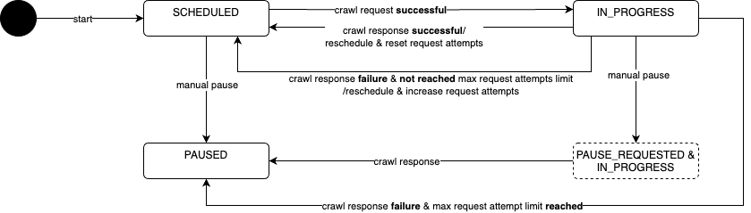
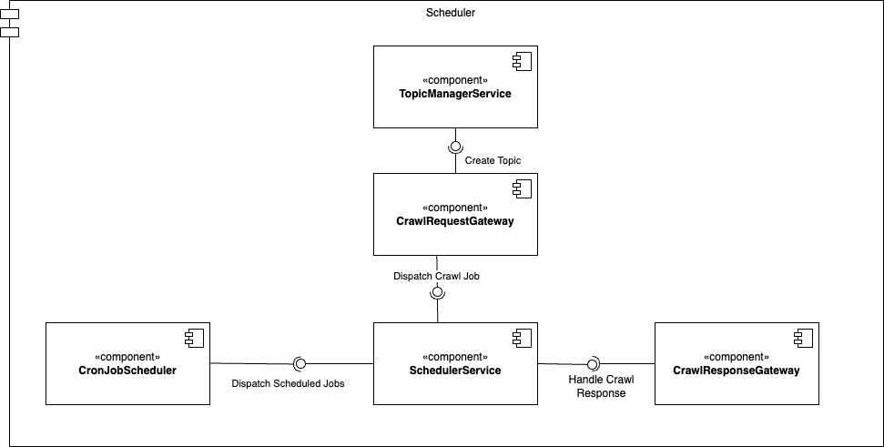

# Service Documentation: URL Scheduler

The **URL Scheduler Service** is responsible for scheduling, dispatching, and managing URL price crawling jobs. 

## Methods

### `startJobById(Long jobId)`
Attempts to restart a crawl job that is paused. If the job is already scheduled or in progress, no action is taken.

- **Parameters:**
  - `jobId`: The ID of the job to be restarted.
- **Returns:** `true` if the job was successfully restarted, `false` if the job was already in the `SCHEDULED` or `IN_PROGRESS` state, or if it could not be restarted.
- **Exceptions:**
  - `IllegalArgumentException`: If `jobId` is null.
  - `NotFoundException`: If the job with `jobId` could not be found.

### `pauseJobById(Long jobId)`
Pauses a crawl job, setting its state to `PAUSED`. If the job is already paused, no action is taken.

- **Parameters:**
  - `jobId`: The ID of the job to be paused.
- **Returns:** `true` if the job was successfully paused, `false` if the job was already paused or could not be paused.
- **Exceptions:**
  - `IllegalArgumentException`: If `jobId` is null.
  - `NotFoundException`: If the job with `jobId` could not be found.

### `dispatchScheduledCrawlJobs(Integer limit)`
Dispatches scheduled crawl jobs that meet the following criteria:
- The job is marked as `SCHEDULED`.
- The job's `next_crawl` time is due.

The jobs are dispatched in order of their `next_crawl` times, up to a specified limit.

- **Parameters:**
  - `limit`: The maximum number of jobs to dispatch in one call. If `limit` is null or omitted, all eligible jobs are dispatched.
- **Throws:** 
  - `IllegalArgumentException`: If `limit` is less than 0.

### `handleCrawlJobResponse(Long jobId, SimpleCrawlResponse crawlResponse)`
Handles the response from a crawl job. Based on the status of the crawl response, it updates the job state or handles retries.

- **Parameters:**
  - `jobId`: The unique identifier of the crawl job.
  - `crawlResponse`: The crawl response of the crawl job, containing the status and crawled timestamp.
- **Throws:**
  - `IllegalArgumentException`: If `jobId` or `status` is null, or if the crawledDate is in the future.
  - `NotFoundException`: If the job with `jobId` could not be found.

## Class Details

### SchedulerService Implementation

This class implements the `SchedulerService` interface and provides the core logic for managing crawl jobs. It interacts with the repository to persist job states and handles job dispatching to the worker queue.

- **Dependencies:**
  - `StoreProductRepository`: Used to retrieve and update store product data.
  - `SchedulerConfigProperties`: Holds configuration for retry attempts.
  - `CrawlRequestGateway`: Responsible for dispatching crawl requests to the worker queue.

## Job Lifecycle - State Diagram

## Configuration

`SchedulerConfigProperties`: Contains the configuration for retry attempts. It includes the field `Integer maxRetryAttempts`. If this field is null, the max retry attempts feature is disabled. If the value is set and the maximum retry attempts are reached, the job is paused.

#### Key Operations:
- **Job Restarting**: Jobs can be restarted from a `PAUSED` state to a `SCHEDULED` state.
- **Job Pausing**: Jobs can be paused either immediately or after the current crawl finishes.
- **Job Dispatching**: Jobs that are due for crawling are dispatched to the worker queue. Failures increment the retry count, and jobs can be paused after reaching the retry limit.
- **Response Handling**: After a crawl job completes, its state is updated, and the next crawl time is recalculated.

### Error Handling
- **Invalid Job IDs**: When a job ID is not found, a `NotFoundException` is thrown.
- **Queue Issues**: If there is an issue dispatching a job to the queue, `QueueDispatchException` or `QueueAccessException` is thrown.
- **Invalid Crawl Responses**: If a crawl response is invalid (e.g., contains a future date), an `IllegalArgumentException` is thrown.

## Conclusion

The **URL Scheduler Service** provides essential functionality for managing the crawling lifecycle of URLs, including pausing, restarting, dispatching, and handling responses. It ensures that the crawling process is robust, handling retries and state transitions to ensure smooth operation and effective monitoring of job states.

## Component Diagram

The component diagram illustrates the architecture of the **Scheduler Service**, highlighting its key components and their responsibilities in managing and processing crawl jobs.

### Components

- **SchedulerService**  
  Serves as the central component responsible for executing the business logic of the scheduling system. It coordinates the flow of crawl jobs and interacts with other components to ensure efficient processing.

- **CronJobScheduler**  
  A time-based job scheduler that dispatches crawl jobs at predefined intervals, as configured in the cron schedule. It ensures timely execution of scheduled tasks.

- **CrawlResponseGateway**  
  Listens to the Kafka topics for crawl responses from the crawler. This component is responsible for processing and handling the results of completed crawl jobs.

- **CrawlRequestGateway**  
  Facilitates communication with the crawler by sending crawl job requests to the appropriate Kafka topic. It ensures the correct routing of job requests.

- **TopicManagerService**  
  Manages Kafka topics used in the scheduling process. It is responsible for creating new topics as needed and maintaining the existing ones.

